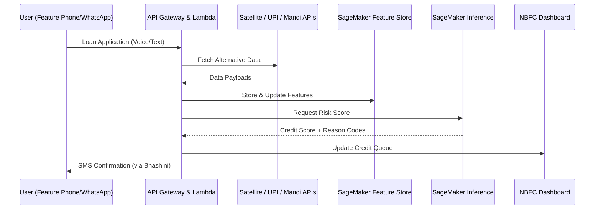

---

# 🛰️ Design Document: Jan-Dhan-Drishti (Rural Credit Scoring AI)

| Field | Details |
| --- | --- |
| **Status** | Prototype / Hackathon Build |
| **Version** | 1.0.0 |
| **Tech Stack** | AWS Serverless, Amazon SageMaker, Bhashini |
| **Target Region** | ap-south-1 (Mumbai) |

---

## 1. Executive Summary

**Jan-Dhan-Drishti** is a multi-modal AI platform designed to bridge the ₹1.5 lakh crore credit gap in rural India. By shifting from "Thin-File" (lack of formal history) to "Live-Performance" (real-time metrics), the system enables NBFCs to underwrite loans for unbanked individuals using UPI transactions, Mandi sales, and satellite-derived crop health indices.

---

## 2. System Architecture

The architecture leverages a **Serverless-First** approach to minimize operational overhead and scale automatically during seasonal peak demand (e.g., harvest seasons).

### 2.1 Workflow Sequence

---

## 3. Data Modalities & Feature Engineering

We employ a **Late-Fusion** strategy, where distinct features are processed in parallel before being combined for final scoring.

### 3.1 Feature Catalog

| Feature ID | Source | Transformation | Weight (Approx) |
| --- | --- | --- | --- |
| `fin_vola_30d` | UPI Logs | Standard deviation of daily inflows | 35% |
| `agri_ndvi_idx` | Sentinel-2 | Mean NDVI of land coordinates | 40% |
| `util_pay_cons` | BBPS API | Payment date variance | 15% |
| `soc_net_score` | Graph DB | Connection risk (Community trust) | 10% |

---

## 4. Machine Learning Pipeline

### 4.1 Hybrid Scoring Logic

The model utilizes a custom ensemble of **XGBoost** (for tabular data) and a **Vision Transformer (ViT)** for satellite imagery analysis.

### 4.2 Explainability & Fairness

To comply with RBI digital lending guidelines, we use **SageMaker Clarify** to:

* **Feature Attribution:** Generate SHAP values for every decision.
* **Bias Detection:** Monitor for disparate impact across demographic segments (age, gender, region) to ensure equitable access.

---

## 5. Security, Compliance & Governance

* **DPDP Act 2023:** All Personal Identifiable Information (PII) is tokenized. Data residency is strictly enforced in the `ap-south-1` region.
* **Consent Management:** Uses the **Account Aggregator (AA)** framework for secure, digital-only data sharing.
* **Agentic Guardrails:** **Amazon Bedrock Guardrails** prevent the system from hallucinating or providing unauthorized financial advice.

---

## 6. Implementation Roadmap

1. **Phase 1:** Synthetic data generation and S3 Data Lake schema definition.
2. **Phase 2:** Automated ETL via AWS Glue and Feature Store ingestion.
3. **Phase 3:** SageMaker Geospatial pipeline for NDVI extraction.
4. **Phase 4:** API deployment and Amplify-based NBFC Dashboard.

---

## 7. Operational Excellence

* **Monitoring:** CloudWatch Metrics for inference latency (Target: <500ms).
* **Cost:** Serverless components ensure near-zero idle costs.
* **Language:** Integration with **Bhashini** ensures the platform is accessible in 22 regional languages.

---
